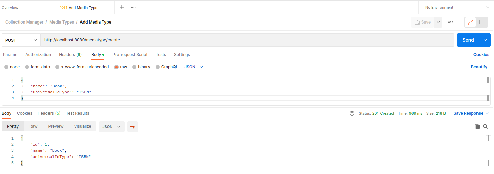

# Collection Manager

**QA Project - Tanveer Najib**

A simple project to allow the categorisation of media (books, movies, video games, music, etc). This project only includes the backend, so there is no frontend code. It exposes data from a MySQL database in a RESTful manner.

**Features**

- Media table
- Get media with id
- Get all media in the database
- Add media
- Delete media
- Update media
- MediaType table
- Get media type with id
- Get all media type in the database
- Add media type
- Delete media type
- Update media type

**What could be improved?**

In the long run, I would like to add more database tables for further categorisation. I would also like to add a nice looking frontend.

**How to run the project**

1. Clone this repository.
2. Port 8080 must be available for the project to run.
3. Install `Eclipse`, `SpringToolSuite`, and `MySQL`
4. Update your database credentials in `application.properties`
5. Run the project from within `SpringToolSuite`.
6. Send requests to the API using an API client such as `Postman` or `Insomnia`.

**Tools used**
- Java
- SpringBoot
- Maven
- MySQL
- Git

## Documentation

**Project Structure**

**Database Structure**

One MediaType can have many Media, however one Media can only have one MediaType. This is a Many-To-One relationship.

**Endpoints**

Media:
- **GET** `media/read/{id}` - Reads specific media from the database with given id.
- **GET** `media/read` - Reads all media in the database.
- **POST** `media/create` - Adds a media to the database. You must include the field values in JSON format in the request body.
- **DEL** `media/delete/{id}` - Deletes media with the given id if it exists in the database.
- **PUT** `media/update/{id}` - Updates a specific media with the given id. You must include the fields in JSON format in the body.

MediaType:
- **GET** `mediatype/read/{id}` - Reads specific media type from the database with given id.
- **GET** `mediatype/read` - Reads all media types in the database.
- **POST** `mediatype/create` - Adds a media type to the database. You must include the field values in JSON format in the request body.
- **DEL** `mediatype/delete/{id}` - Deletes a media type with the given id if it exists in the database.
- **PUT** `mediatype/update/{id}` - Updates a specific media type with the given id. You must include the fields in JSON format in the body.

**Postman**

A Postman collection is available. You can use it to import the collection to your Postman account: [Postman Collection](Collection-Manager.postman_collection.json)

*Structure*

*Add Media Type*

*Get All Media Type*

*Get Media Type*

*Update Media Type*

*Delete Media Type*

*Add Media*

*Get All Media*

*Get Media*

*Update Media*

*Delete Media*

**Tests**

All tests are located in the [src/test/java/com/example](src/test/java/com/example) folder.

*Media Type Service Tests*

*Media Service Tests*

*Media Integration Tests*

